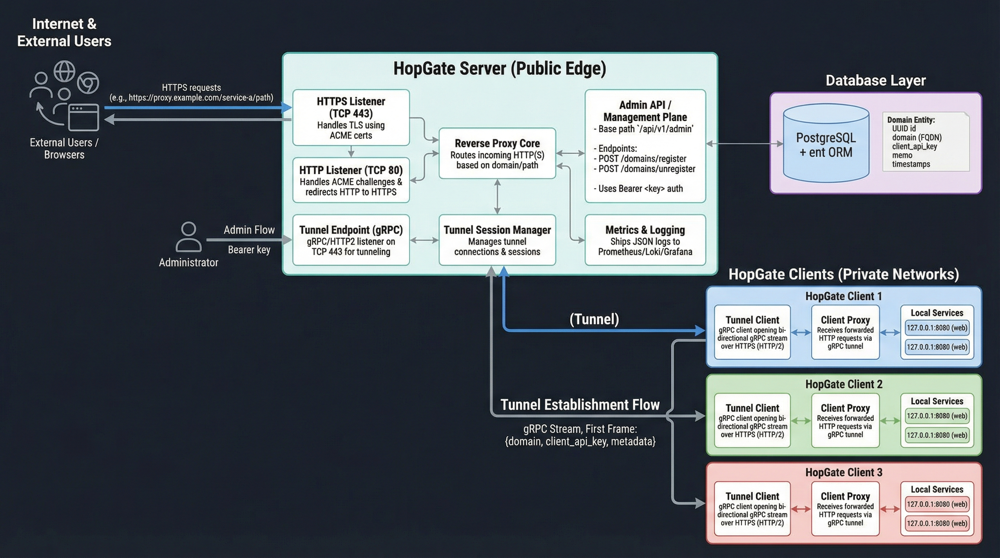

# HopGate Architecture / HopGate 아키텍처

이 문서는 HopGate 시스템의 전체 구조를 설명합니다. (ko)  
This document describes the overall architecture of the HopGate system. (en)

---

## 1. Overview / 전체 개요

- HopGate는 공인 서버와 여러 프라이빗 네트워크 클라이언트 사이에서 HTTP(S) 트래픽을 터널링하는 게이트웨이입니다. (ko)
- HopGate is a gateway that tunnels HTTP(S) traffic between a public server and multiple private-network clients. (en)

- 서버는 80/443 포트를 점유하고, ACME(Let's Encrypt 등)로 TLS 인증서를 자동 발급/갱신합니다. (ko)
- The server listens on ports 80/443 and automatically issues/renews TLS certificates using ACME (e.g. Let's Encrypt). (en)

- 전송 계층은 **TCP + TLS(HTTPS) + HTTP/2 + gRPC** 기반의 터널을 사용해 서버–클라이언트 간 HTTP 요청/응답을 멀티플렉싱합니다. (ko)
- The transport layer uses a **TCP + TLS (HTTPS) + HTTP/2 + gRPC**-based tunnel to multiplex HTTP requests/responses between server and clients. (en)

- 클라이언트는 장기 유지 gRPC bi-directional stream 을 통해 서버와 터널을 형성하고,
  서버가 전달한 HTTP 요청을 로컬 서비스(127.0.0.1:PORT)에 대신 보내고 응답을 다시 서버로 전달합니다. (ko)
- Clients establish long-lived gRPC bi-directional streams as tunnels to the server,
  forward HTTP requests to local services (127.0.0.1:PORT), and send responses back to the server. (en)

- 관리 Plane(REST API)을 통해 도메인 등록/해제 및 클라이언트 API Key 발급을 수행합니다. (ko)
- An admin plane (REST API) is used to register/unregister domains and issue client API keys. (en)

---

## 2. Directory Layout / 디렉터리 레이아웃

```text
.
├── cmd/
│   ├── server/              # server binary entrypoint
│   └── client/              # client binary entrypoint
├── internal/
│   ├── config/              # shared configuration loader
│   ├── acme/                # ACME certificate management
│   ├── proxy/               # HTTP proxy / tunneling core (gRPC tunnel)
│   ├── protocol/            # server-client message protocol
│   ├── admin/               # admin plane HTTP handlers
│   └── logging/             # structured logging utilities
├── ent/
│   └── schema/              # ent schema definitions (e.g. Domain)
└── pkg/
    └── util/                # reusable helpers (optional)
```

---

### 2.1 `cmd/`

- [`cmd/server/main.go`](cmd/server/main.go) — 서버 실행 엔트리 포인트. 서버 설정 로딩, ACME/TLS 초기화, HTTP/HTTPS 리스너 및 gRPC 터널 엔드포인트 시작을 담당합니다. (ko)
- [`cmd/server/main.go`](cmd/server/main.go) — Server entrypoint. Loads configuration, initializes ACME/TLS, and starts HTTP/HTTPS listeners plus the gRPC tunnel endpoint. (en)

- [`cmd/client/main.go`](cmd/client/main.go) — 클라이언트 실행 엔트리 포인트. 설정 로딩, gRPC/HTTP2 터널 연결, 로컬 서비스 프록시 루프를 담당합니다. (ko)
- [`cmd/client/main.go`](cmd/client/main.go) — Client entrypoint. Loads configuration, establishes a gRPC/HTTP2 tunnel to the server, and runs the local proxy loop. (en)

---

### 2.2 `internal/config`

- 서버와 클라이언트가 공통으로 사용하는 설정 스키마 및 `.env`/환경 변수 로더를 제공합니다. (ko)  
- Provides shared config structs for server and client, plus `.env`/environment variable loaders. (en)

- 주요 구조체 / Main structs: (ko/en)  
  - `ServerConfig` — HTTP/HTTPS/DTLS 리스닝 주소, 도메인/프록시 도메인, Debug 플래그, 로그 설정. (ko)  
  - `ServerConfig` — HTTP/HTTPS/DTLS listen addresses, main/proxy domains, debug flag, logging config. (en)  
  - `ClientConfig` — 서버 주소, 도메인, 클라이언트 API Key, local_target, Debug 플래그, 로그 설정. (ko)  
  - `ClientConfig` — server address, domain, client API key, local_target, debug flag, logging config. (en)

---

### 2.3 `internal/acme`

- ACME(예: Let's Encrypt) 클라이언트 래퍼 및 인증서 매니저를 구현하는 패키지입니다. (ko)  
- Package that will wrap an ACME client (e.g. Let's Encrypt) and manage certificates. (en)

- 역할 / Responsibilities: (ko/en)
  - 메인 도메인 및 프록시 서브도메인용 TLS 인증서 발급/갱신. (ko)
  - Issue/renew TLS certificates for main and proxy domains. (en)
  - HTTP-01 / TLS-ALPN-01 챌린지 처리 훅 제공. (ko)
  - Provide hooks for HTTP-01 / TLS-ALPN-01 challenges. (en)
  - HTTPS 및 gRPC 터널 리스너에 사용할 `*tls.Config` 제공. (ko)
  - Provide `*tls.Config` for HTTPS and gRPC tunnel listeners. (en)

---

### 2.4 (Reserved for legacy DTLS prototype)

> 초기 버전에서 DTLS 기반 터널을 실험했으나, 현재 설계에서는 **gRPC/HTTP2 터널만** 사용합니다.
> DTLS 관련 코드는 점진적으로 제거하거나, 별도 브랜치/히스토리에서만 보존할 예정입니다. (ko)
> Early iterations experimented with a DTLS-based tunnel, but the current design uses **gRPC/HTTP2 tunnels only**.
> Any DTLS-related code is planned to be removed or kept only in historical branches. (en)

---

### 2.5 `internal/protocol`

- 서버와 클라이언트가 **gRPC/HTTP2 터널 전송 계층** 위에서 주고받는 HTTP 요청/응답 및 스트림 메시지 포맷을 정의합니다. (ko)
- Defines HTTP request/response and stream message formats exchanged over the gRPC/HTTP2 tunnel transport layer. (en)

- 요청 메시지 / Request message: (ko/en)
  - `RequestID`, `ClientID`, `ServiceName`, `Method`, `URL`, `Header`, `Body`. (ko/en)

- 응답 메시지 / Response message: (ko/en)
  - `RequestID`, `Status`, `Header`, `Body`, `Error`. (ko/en)

- 스트림 기반 터널링을 위한 Envelope/Stream 타입: (ko/en)
  - [`Envelope`](internal/protocol/protocol.go:64) — 상위 메시지 컨테이너. (ko/en)
  - [`StreamOpen`](internal/protocol/protocol.go:94) — 새로운 스트림 오픈 및 헤더/메타데이터 전달. (ko/en)
  - [`StreamData`](internal/protocol/protocol.go:104) — 시퀀스 번호(Seq)를 가진 바디 chunk 프레임. (ko/en)
  - [`StreamClose`](internal/protocol/protocol.go:143) — 스트림 종료 및 에러 정보 전달. (ko/en)
  - [`StreamAck`](internal/protocol/protocol.go:117) — 선택적 재전송(Selective Retransmission)을 위한 ACK/NACK 힌트. (ko/en)

- 이 구조는 Protobuf 기반 length-prefix 프레이밍을 사용하며, gRPC bi-di stream 의 메시지 타입으로 매핑됩니다. (ko)
- This structure uses protobuf-based length-prefixed framing and is mapped onto messages in a gRPC bi-di stream. (en)

---

### 2.6 `internal/proxy`

- HTTP Reverse Proxy 및 클라이언트 측 로컬 프록시 코어 로직을 담당합니다. (ko)  
- Contains the core logic for the HTTP reverse proxy on the server and the local proxy on the client. (en)

#### 서버 측 역할 / Server-side role

- 공인 HTTPS 엔드포인트에서 들어오는 요청을 수신합니다. (ko)
- Receive incoming requests on the public HTTPS endpoint. (en)

- 도메인/패스 규칙에 따라 적절한 클라이언트와 서비스로 매핑합니다. (ko)
- Map requests to appropriate clients and services based on domain/path rules. (en)

- 요청/응답을 `internal/protocol` 의 스트림 메시지(`StreamOpen` / `StreamData` / `StreamClose` 등)로 직렬화하여
  서버–클라이언트 간 gRPC bi-di stream 위에서 주고받습니다. (ko)
- Serialize requests/responses into stream messages from `internal/protocol` (`StreamOpen` / `StreamData` / `StreamClose`, etc.)
  and exchange them between server and clients over a gRPC bi-di stream. (en)

#### 클라이언트 측 역할 / Client-side role

- 서버가 gRPC 터널을 통해 내려보낸 스트림 메시지를 수신합니다. (ko)
- Receive stream messages sent by the server over the gRPC tunnel. (en)

- 로컬 HTTP 서비스(예: 127.0.0.1:8080)에 요청을 전달하고 응답을 수신합니다. (ko)
- Forward these requests to local HTTP services (e.g. 127.0.0.1:8080) and collect responses. (en)

- 응답을 동일한 gRPC bi-di stream 상의 역방향 스트림 메시지로 직렬화하여 서버로 전송합니다. (ko)
- Serialize responses as reverse-direction stream messages on the same gRPC bi-di stream and send them back to the server. (en)

---

### 2.7 `internal/logging`

- Loki/Grafana 스택에 적합한 구조적 JSON 로깅 인터페이스를 제공합니다. (ko)  
- Provides a structured JSON logging interface compatible with the Loki/Grafana stack. (en)

- 공통 필드 (예: component, request_id, client_id, domain 등)를 포함한 Logger 를 제공합니다. (ko)  
- Offers a Logger that includes common fields (e.g., component, request_id, client_id, domain). (en)

---

### 2.8 `ent/schema`

- `Domain` 등 엔티티에 대한 ent 스키마를 정의합니다. (ko)  
- Defines ent schemas for entities such as `Domain`. (en)

- Domain 엔티티는 다음 정보를 포함합니다: (ko)  
- The Domain entity contains the following fields: (en)  
  - UUID `id` — 기본 키 / primary key. (ko/en)  
  - `domain` — FQDN (예: app.example.com). (ko/en)  
  - `client_api_key` — 클라이언트 인증용 64자 키. (ko/en)  
  - `memo` — 관리자 메모. (ko/en)  
  - `created_at`, `updated_at` — 감사용 타임스탬프. (ko/en)

---

### 2.9 `pkg/util` (optional)

- 재사용 가능한 헬퍼 함수/유틸리티를 둘 수 있는 선택적 패키지입니다. (ko)  
- Optional package for reusable helpers and utilities. (en)

---

## 3. Request Flow Summary / 요청 흐름 요약

1. 외부 사용자가 `https://proxy.example.com/service-a/path` 로 HTTPS 요청을 보냅니다. (ko)
An external user sends an HTTPS request to `https://proxy.example.com/service-a/path`. (en)

2. HopGate 서버의 HTTPS 리스너가 요청을 수신합니다. (ko)  
The HTTPS listener on the HopGate server receives the request. (en)

3. `proxy` 레이어가 도메인과 경로를 기반으로 이 요청을 처리할 클라이언트(예: client-1)와 해당 로컬 서비스(`service-a`)를 결정합니다. (ko)
The `proxy` layer decides which client (e.g., client-1) and which local service (`service-a`) should handle the request, based on domain and path. (en)

4. 서버는 요청을 `internal/protocol` 의 스트림 메시지(예: `StreamOpen` + 여러 `StreamData` + `StreamClose`)로 직렬화하고,
   선택된 클라이언트와 맺은 gRPC bi-di stream 을 통해 전송합니다. (ko)
   The server serializes the request into stream messages from `internal/protocol` (e.g., `StreamOpen` + multiple `StreamData` + `StreamClose`)
   and sends them over a gRPC bi-di stream to the selected client. (en)

5. 클라이언트의 `proxy` 레이어는 이 스트림 메시지들을 수신해 로컬 서비스(예: 127.0.0.1:8080)에 HTTP 요청을 수행합니다. (ko)
   The client’s `proxy` layer receives these stream messages and performs an HTTP request to a local service (e.g., 127.0.0.1:8080). (en)

6. 클라이언트는 로컬 서비스로부터 HTTP 응답을 수신하고, 이를 역방향 스트림 메시지(`StreamOpen` + 여러 `StreamData` + `StreamClose`)로 직렬화하여
   동일한 gRPC bi-di stream 을 통해 서버로 다시 전송합니다. (ko)
   The client receives the HTTP response from the local service, serializes it as reverse-direction stream messages
   (`StreamOpen` + multiple `StreamData` + `StreamClose`), and sends them back to the server over the same gRPC bi-di stream. (en)

7. 서버는 응답 스트림 메시지를 조립해 원래의 HTTPS 요청에 대한 HTTP 응답으로 변환한 뒤, 외부 사용자에게 반환합니다. (ko)
   The server reassembles the response stream messages into an HTTP response for the original HTTPS request and returns it to the external user. (en)



---

## 4. Next Steps / 다음 단계

- 위 아키텍처를 기반으로 디렉터리와 엔트리 포인트를 생성/정리합니다. (ko)
- Use this architecture to create/organize directories and entrypoints. (en)

- `internal/config` 에 필요한 설정 필드와 `.env` 로더를 확장합니다. (ko)
- Extend `internal/config` with required config fields and `.env` loaders. (en)

- `internal/acme` 에 ACME 클라이언트(certmagic 또는 lego 등)를 연결해 TLS 인증서 발급/갱신을 구현합니다. (ko)
- Wire an ACME client (certmagic, lego, etc.) into `internal/acme` to implement TLS certificate issuance/renewal. (en)

- gRPC/HTTP2 기반 터널 전송 계층을 설계/구현하고, 서버/클라이언트 모두에서 장기 유지 bi-di stream 위에
  HTTP 요청/응답을 멀티플렉싱하는 로직을 추가합니다. (ko)
- Design and implement a gRPC/HTTP2-based tunnel transport layer, adding logic on both server and client to multiplex HTTP requests/responses over long-lived bi-di streams. (en)

- `internal/protocol` 과 `internal/proxy` 를 통해 실제 HTTP 터널링을 구현하고,
  gRPC 기반 스트림 모델이 재사용할 수 있는 논리 프로토콜로 정리합니다. (ko)
- Implement real HTTP tunneling and routing rules via `internal/protocol` and `internal/proxy`,
  organizing the logical protocol so that the gRPC-based stream model can reuse it. (en)

- `internal/admin` + `ent` + PostgreSQL 을 사용해 Domain 등록/해제 및 클라이언트 API Key 발급을 완성합니다. (ko)
- Complete domain registration/unregistration and client API key issuing using `internal/admin` + `ent` + PostgreSQL. (en)

- 로깅/메트릭을 Prometheus + Loki + Grafana 스택과 연동하여 운영 가시성을 확보합니다. (ko)
- Integrate logging/metrics with the Prometheus + Loki + Grafana stack to gain operational visibility. (en)